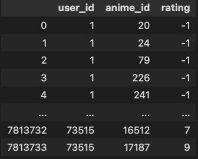
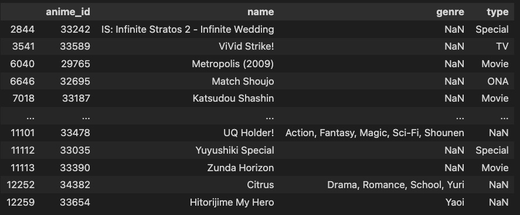
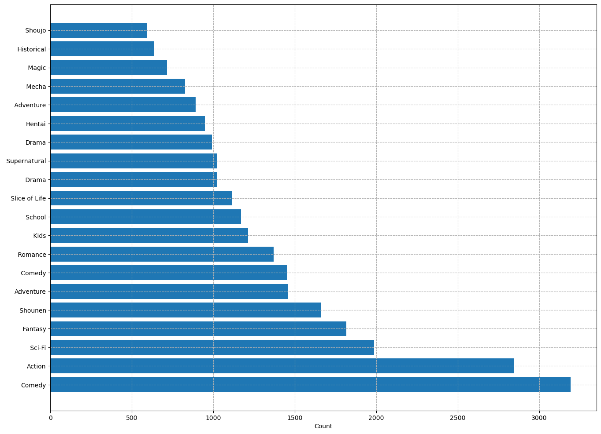
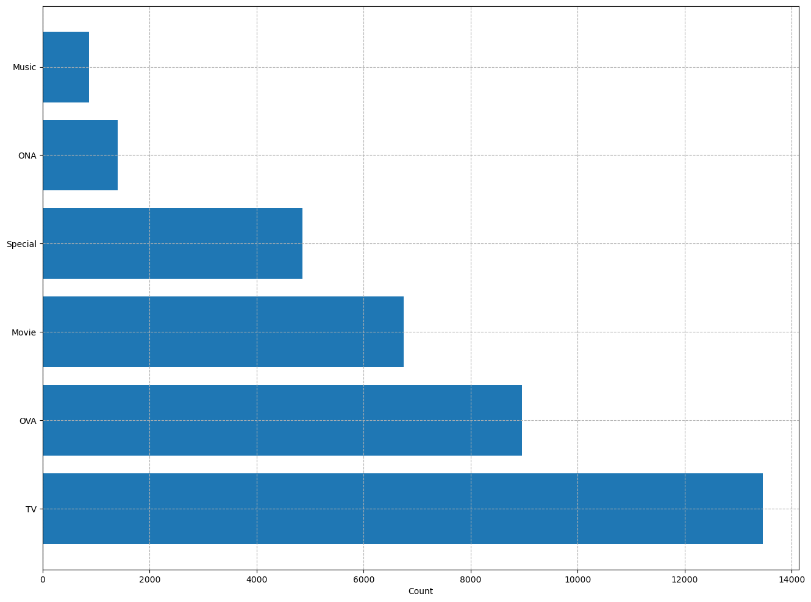
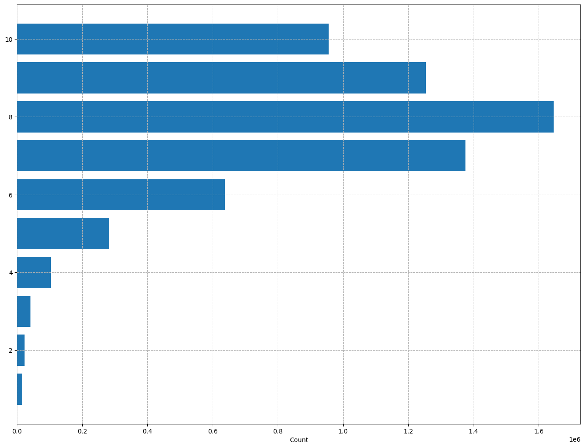
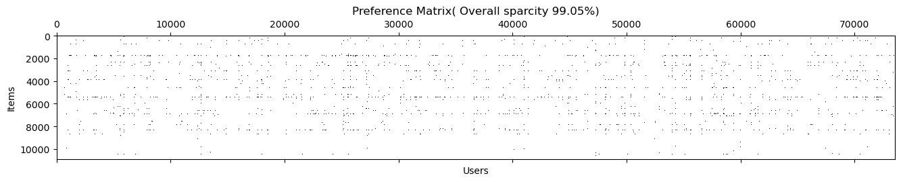
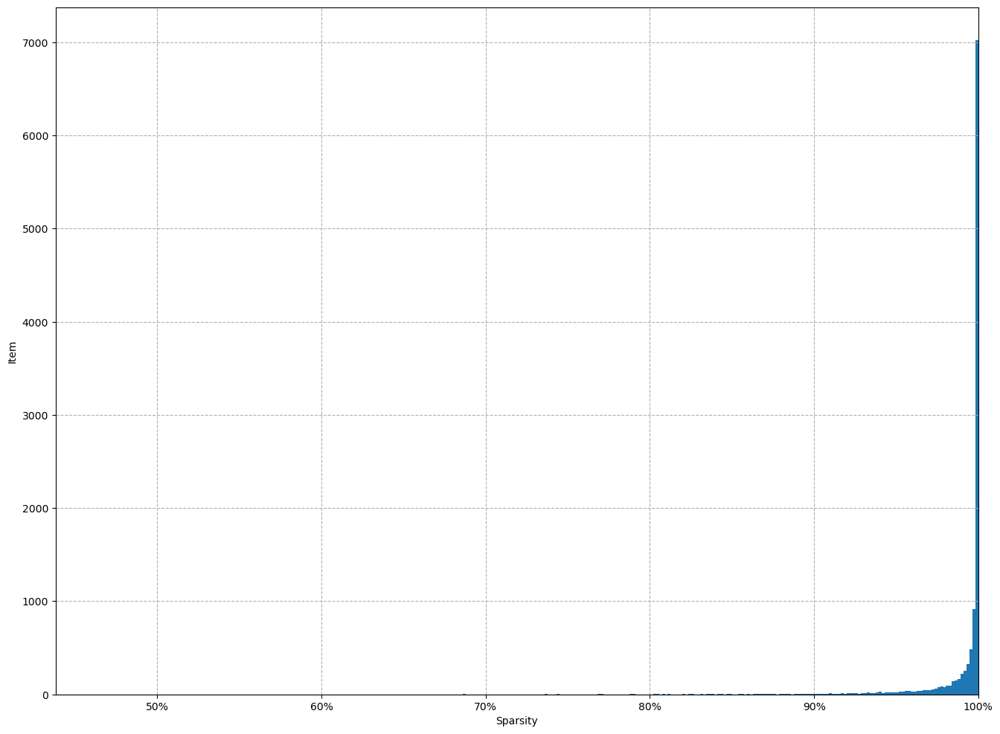
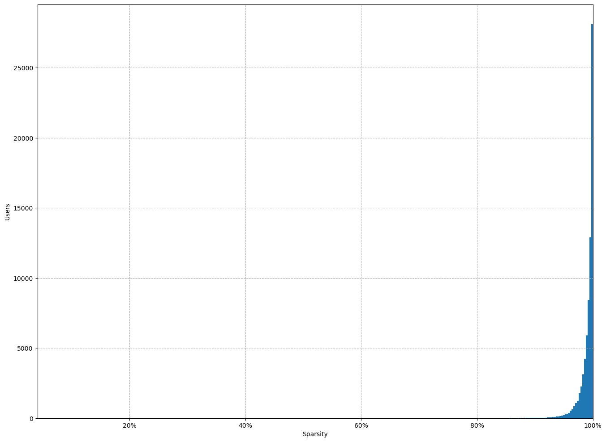
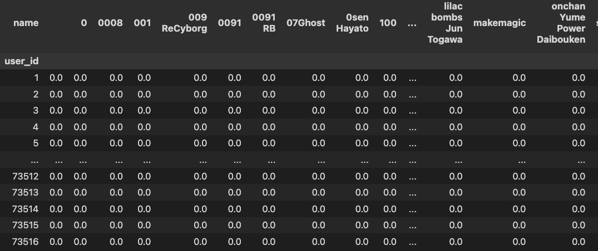

    <h2>  Sistema de recomendacao

 Sistema de Recomendação fornece sugestões a usuários, ajudando-os a tomar decisões em meio a uma grande quantidade de opções. Esses sistemas desempenham um papel fundamental em diversas áreas, desde o comércio eletrônico até o streaming de conteúdo, personalizando a experiência do usuário e facilitando a descoberta de novos itens de interesse. Existem diferentes tipos de sistemas de recomendação, cada um projetado para atender a necessidades específicas. Aqui estão alguns dos tipos básicos:
1. Recomedacao nao personalizada
2. Recomendacao baseado em conteudo
3. Filtragem colaborativa
4. Recomendacao Hibrida

    <h2> Business Case

**Sasaki.Corp**, uma empresa que fornece serviços de jogos e vídeos via streaming, decide aumentar a eficiência na entrega de conteúdos e aprimorar a experiência do usuário do serviço Animeflix. Com esse objetivo, ela sugeriu à equipe de dados uma versão beta de um sistema de recomendação capaz de oferecer sugestões personalizadas aos usuários desse serviço. O projeto ainda está em desenvolvimento, com o codinome **#DataGlowUp**.

    <h2> EDA

### Objetivo inicial
O objetivo da análise é compreender como os usuários interagem, por meio de um conjunto de dados contendo as avaliações de cada usuário (**ratings**) e outro conjunto de dados com os títulos dos animes (**anime**), juntamente com informações sobre o site. A intenção é identificar padrões de comportamento para que possamos recomendar itens mais adequados a cada usuário.

Os conjuntos de dados possuem as características descritas a seguir: rating e anime, respectivamente.

Como visto, enfrentamos alguns problemas no conjunto de dados, como valores ausentes (NaN) e avaliações negativas. Os valores negativos foram atribuídos à parte responsável pela geração dos dados, explicando que esses valores foram imputados nos campos sem avaliação, considerando-se que, se necessário, poderiam ser transformados em NaN ou 0, uma vez que as avaliações variam de 1 a 10.

Seguindo essa recomendação, a equipe de Data Science optou, inicialmente, por substituir esses valores por NaN, entendendo que valores NaN podem fornecer mais informações para análises de matriz de preferências. No caso dos valores NaN no conjunto de dados de Anime, na coluna de gêneros, eles foram substituídos por 'No Class', a princípio

### Caracteristica dos dados
Para o nosso dataset de  **anime** temos as seguintes caracteristicas para os tipo de 
* Generos de desenho
  
| Genre     | Count | 
|-----------|-------|
|  Comedy   | 3193  | 
|  Action   | 2845  |  
|  Sci-Fi   | 1986  |

* Types

| Types     | Count | 
|-----------|-------|
|  TV       | 134583| 
|  OVA      | 8959  |  
|  Movie    | 6744  |

* Ratings

| Rating    | Count  | 
|-----------|--------|
|  8.0      |1646019 | 
|  7.0      |1375287 |  
|  9.0      | 1254096|

    <h2>  Esparcidade/Sparcity

* Esparsidade é um conceito que utilizamos para medir quantos dados estão faltando no nosso dataset para entendermos o usuário. Os usuários não costumam avaliar a maioria dos itens que você tem no seu sistema de recomendação.
* A _overall sparsity_ (OS) pode ser calculada como:

$$OS = 1 - \frac{\#ratings}{\#users \times \#items}$$

onde $\#ratings$ é o número de avaliações dadas, $\#users$ é o número de usuários no sistema e $\#items$ é o número de itens no catálogo. **Quanto menos avaliações tivermos dos usuários, maior será a esparsidade**.

Exemplo:

- Poucas avaliações preenchidas: $OS \rightarrow 100\%$ (alta esparsidade)
- Muitas avaliações preenchidas: $OS \rightarrow 0\%$ (baixa esparsidade)

No nosso dataset temos um total de **99%** de esparcidade, isso corrobora a ideia inicial que a maioria do nosso catalogo nao esta sendo avaliado pelo nossos usarios( grafico abaixo mostra o quao esparco esta o nosso dataset)

De forma análoga à _overall sparsity_ , também podemos calcular a _User Specific Sparsity_ (USS) e a _Item Specific Sparsity_ (ISS) da seguinte forma:

$$USS(\mathbf{u}) = 1 - \frac{\#ratings_\mathbf{u}}{\#items}$$

$$ISS(\mathbf{i}) = 1 - \frac{\#ratings_\mathbf{i}}{\#users}$$

Onde $\#ratings_\mathbf{u}$ é a quantidade de avaliações do usuário $\mathbf{u}$ e $\#ratings_\mathbf{i}$ é a quantidade de avaliações do item $\mathbf{i}$.

Exemplos:

- Usuário com poucas avaliações: $USS(\mathbf{u}) \rightarrow 100\%$
- Itens com muitas avaliações: $ISS(\mathbf{i}) \rightarrow 0\%$

Com esses calculos chegamos na conclusao tambem que a os nossos usuarios nao avaliam os nosso animes e a quase na sua totalidade dos titulos tambem nao sao avaliados
* ISS

* USS

E com isso tambem consiguimos entender melhor quais sao as preferencias dos usuarios e conseguindo gerear assim duas matriz uma de preferencia com 0,1, e outra de similaridade com valores **entre** 0 a 1, onde valores mais proximos a 1 sao itens mais similares

* Matrix preferencia

* Matriz similaridade entre os titulos
  
  